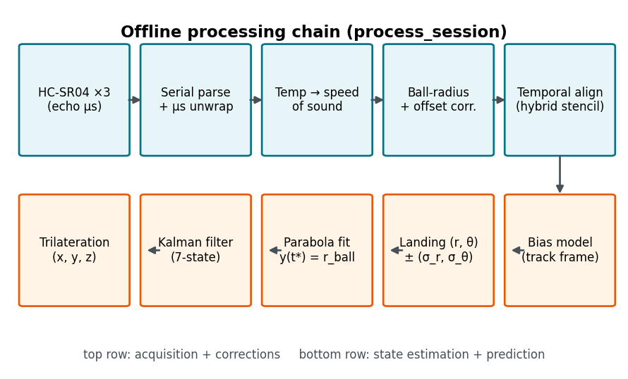
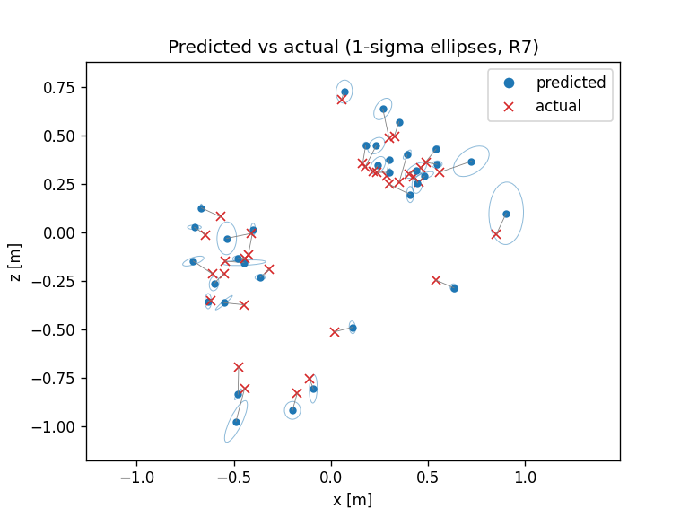

# Ultrasonic Landing Prediction

**Predicting where a thrown basketball will land, from three $2 ultrasonic sensors and a Kalman filter, then
checking the result against a camera.**

A measurement-engineering project from *Measurements for Mechanical Engineering*
(Politecnico di Milano, A.Y. 2025-26). Three HC-SR04 ultrasonic sensors sit at the corners of a 1 m
equilateral triangle on the floor. A basketball thrown over the array is ranged by sequential pings; the
trajectory is reconstructed by trilateration, smoothed by a Kalman filter, fitted with a parabola, and
extrapolated to the floor to predict the landing point in polar coordinates (r, theta) with a per-throw
uncertainty.

The repo has two parts:

| Folder | What it is | Status |
|---|---|---|
| [`code/`](code/) | The ultrasonic landing predictor: firmware, processing pipeline, simulator, HTML reports, bias calibration, and the 34-throw live campaign | Complete, 242 tests passing |
| [`optical/`](optical/) | A standalone phone-camera module that recovers the landing point from video, built as an independent cross-check | Closed, **NO-GO** against its pre-registered accuracy gate (a characterised negative result) |



## Results at a glance

**Live campaign:** 34 hardware throws on 2026-07-09, each ground-truthed with a tape-measure multilateration
protocol (centroid plus the two nearest sensors, least squares).

- The offline bias model, calibrated on 31 of the throws, found a significant along-track systematic of
  **67.5 mm** (95% CI [45.7, 89.4] mm, so it excludes zero). On held-out throws it cut the mean error from
  **90.2 mm to 56.1 mm** (p of about 0.0001).
- Over all 34 throws the delivered system has a mean 2-D landing error of about **65 mm** (bias model applied).



**What mattered most (leave-one-out ablation on the real campaign).** Starting from the delivered pipeline
and switching off one correction at a time:

| Correction removed | Change in mean error | Significant at n = 34? |
|---|---:|:---:|
| Ball-radius (surface to centre) range correction | **+99.3 mm** | yes |
| Hybrid finite-difference stencil (back to forward) | +65.6 mm, and 18 throws lose their prediction | yes |
| Track-aligned bias model | +27.9 mm | yes |
| Landing at y = r_ball instead of y = 0 | +21.2 mm | yes |
| Kalman filter | +4.3 mm | no |
| Per-sensor electronic offset | +3.2 mm | no |
| Temperature-based speed of sound | +1.9 mm | no |
| Sensor-height correction | +1.2 mm | no |
| Mid-echo sample instant | +0.0 mm | no |

With every correction off at once, the legacy pipeline can predict only **16 of the 34 throws**, because
forward differencing throws away the last triplet and many throws only have four. Full table and method:
[`code/LEGACY_ABLATION_RESULTS.md`](code/LEGACY_ABLATION_RESULTS.md).

**Optical cross-check (negative result).** A phone filming at 240 fps tracked the ball and mapped its contact
point to the floor through a homography. The pre-registered acceptance gate was RMS <= 15 mm over >= 8 static
points; the measured RMS was **64.4 mm** as captured (55.3 mm in a best-case diagnostic). The gate was not
renegotiated. The cause was physical (about 17 mm survey/intrinsics/floor-planarity floor, plus 20-40 mm of
camera movement between calibration and capture), not a software bug. The module also found and fixed two
real detector bugs on real footage (hue wrap-around for a red ball, and hull-based circularity). Details:
[`optical/Phase5_Commissioning_Report_2026-07-11.md`](optical/Phase5_Commissioning_Report_2026-07-11.md).

## Design choices worth a look

- **Spec-driven, simulator-first.** Every processing layer is validated against synthetic data with exact
  ground truth before the next layer is built, including *negative controls* (turn one correction off and the
  acceptance test must fail, or the finding is documented as below the noise floor).
- **Honest findings.** The specs record where original requirements turned out impossible or vacuous, for
  example a 3-sensor consistency residual that is zero by construction, and a "<1 mm on a curved arc" claim
  that cannot hold.
- **Raw data is sacred.** Every serial byte is logged verbatim before any gating; gating is recorded as
  flags, never by deleting rows.
- **Pure core, thin I/O shell.** The computational modules do no file or serial I/O; one orchestrator
  (`process_session`) is shared by the live program, the acceptance tests, and the offline tools.
- **Self-contained HTML reports** with a local-only server for entering ground truth, with atomic,
  read-back-verified writes.

## Hardware

3x HC-SR04 ultrasonic sensors on a 1.0 m equilateral triangle (each tilted 55 degrees inward), driven by an
Arduino Nano Every in rigid 18 ms slots (54 ms per triplet). The firmware streams raw echo times in
microseconds; all distance maths happens in Python. Sketches are in [`code/firmware/`](code/firmware/), the
bench procedure in [`code/BENCH_PROCEDURE_v2.pdf`](code/BENCH_PROCEDURE_v2.pdf).

## Quick start (no hardware needed)

Python 3.10+ is required (Windows commands shown; the code itself is portable).

```powershell
cd code
python -m venv venv
.\venv\Scripts\python.exe -m pip install -r requirements.txt
.\venv\Scripts\python.exe -m pytest tests -q            # expect: 242 passed

# Generate and process 3 synthetic throws, then open the HTML reports
.\venv\Scripts\python.exe scripts\simulate_session.py --n-sessions 3 --beam-cone off --drag quadratic --seed 11
# open: data\sessions\demo\campaign.html
```

The real 34-throw campaign dashboard is already rendered at `code/data/sessions/campaign.html` and each
throw's `report.html` sits in its own session folder. See [`code/README.md`](code/README.md) and
[`optical/README.md`](optical/README.md) for each module.

## Repository map

```
code/                      ultrasonic system
  pipeline/                geometry, corrections, trilateration, kalman, landing, bias, simulator, reports
  scripts/                 run_session, simulate_session, calibrate_bias, analyze_campaign, serve_report ...
  firmware/                five incremental Arduino sketches
  tests/                   242 tests incl. the synthetic end-to-end acceptance gate
  data/sessions/           34 live throws (raw serial logs + results) and synthetic demo sessions
  CLAUDE.md                authoritative specification (v2.8)
  IMPLEMENTATION_NOTES.md  as-built record, findings ledger, decision register
optical/                   camera ground-truth module (closed, NO-GO)
  optical/ simulator/ scripts/ tests/   pipeline, synthetic footage, CLIs, 185 tests
  CLAUDE.md                authoritative specification (v1.6)
  IMPLEMENTATION_NOTES_OPTICAL.md       as-built record incl. Phase 5 commissioning
docs/                      slide-figure scripts and archived original READMEs
```

## Not included in this repository

Raw phone footage (about 1 GB), the raw calibration photos, and the slide deck are too large for git. They
are attached to the [v1.0 release](https://github.com/ObsidianFury1/ultrasonic-landing-prediction/releases/tag/v1.0):

- [`optical-footage.zip`](https://github.com/ObsidianFury1/ultrasonic-landing-prediction/releases/download/v1.0/optical-footage.zip)
  (1.08 GB): the optical clips, calibration photos and calibration frames. See
  [`optical/data/optical/README.md`](optical/data/optical/README.md) for how to restore it.
- [`Politecnico_Milano_Measurements_Presentation.pptx`](https://github.com/ObsidianFury1/ultrasonic-landing-prediction/releases/download/v1.0/Politecnico_Milano_Measurements_Presentation.pptx)
  (55 MB): the project presentation. The scripts that generated its figures are in
  [`docs/presentation-figures/`](docs/presentation-figures/).

Every other result in this README can be reproduced from the files here.

## How it was built

The project followed a spec-first workflow with AI assistance (Claude Code): `CLAUDE.md` in each module is
the authoritative build specification, and `IMPLEMENTATION_NOTES*.md` records every deviation, finding, and
decision. Design decisions, measurements, and the final conclusions are the author's.

## License

MIT, see [`LICENSE`](LICENSE).
